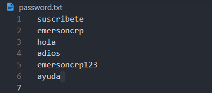
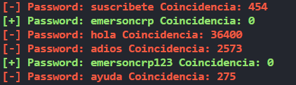

# Verificador de Coincidencia de Contraseñas con Python

El objetivo de script de Python es verificar si las contraseñas proporcionadas en el archivo `password.txt` han sido comprometidas previamente y si existe alguna coincidencia con las filtraciones de contraseñas conocidas.

## Requisitos
- requests
```
pip install requests
```
- termcolor
```
pip install termcolor
```

## API de Have i Peen Pwned


## Contraseñas 


## Resultados


